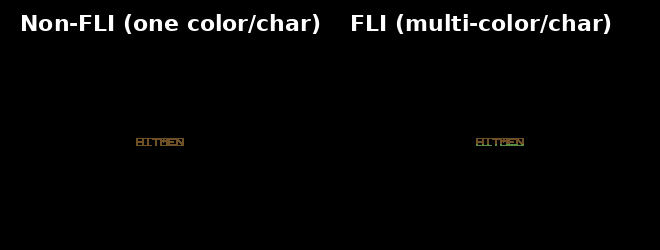

# HITMEN TRUE FLI Multicolor Logo Generator

This tool generates a "HITMEN" logo for the Commodore 64 demonstrating **TRUE FLI** (Flexible Line Interpretation) with **MULTIPLE COLORS PER CHARACTER**.

## What is TRUE FLI?

**TRUE FLI** means each 8x8 character can display **MULTIPLE COLORS** vertically:

- **FLI mode**: Each of the 8 scanlines within a character can have its OWN color
  - This creates a **RAINBOW/GRADIENT effect** within each character
  - The SAME letter 'H' shows red, orange, yellow, green, blue all at once!
  - This is THE defining feature of FLI

- **Non-FLI mode**: Each 8x8 character can only be ONE color
  - All 8 scanlines must use the same color
  - A letter can be red OR blue OR green, but NOT all three
  - NO rainbow effect possible

## Why Previous Versions Were Wrong

**Version 1**: Used horizontal color bands across the entire screen - this can be done with standard $d800 color RAM (NOT FLI)

**Version 2**: Used scanline-level color bands cutting through characters - still just horizontal stripes (NOT TRUE FLI)

**Version 3 (THIS VERSION)**: Each character has its own internal rainbow gradient - **THIS IS TRUE FLI!**

## Features

- **Multiple Colors Per Character**: Rainbow gradient within each 8x8 character block
- **Custom FLI Font**: Designed with horizontal stripes to maximize FLI effect visibility
- **Colodore Palette**: Hardware-measured C64 colors with gamma correction
- **Side-by-Side Comparison**: Monochrome non-FLI vs rainbow FLI
- **C64 Assembly Data**: Include files with character bitmaps and scanline colors

## Generated Files

- `hitmen_fli_logo.png` - FLI version with rainbow gradient in each character
- `hitmen_non_fli_logo.png` - Non-FLI version with single color per character
- `hitmen_comparison.png` - Side-by-side comparison
- `hitmen_fli_data.i` - Assembly data file for C64 demos
- `fli_font_data.py` - FLI font character definitions

## Usage

```bash
python3 generate_hitmen_fli_logo.py
```

## Requirements

- Python 3.6+
- Pillow (PIL) library

Install dependencies:
```bash
pip install Pillow
```

## Technical Details

### TRUE FLI Implementation

Each character is rendered with 8 different colors (one per scanline):
1. Character bitmap defines the shape (e.g., letter 'H')
2. Each of the 8 scanlines gets a different color from the gradient
3. Result: Rainbow effect within the character - IMPOSSIBLE without FLI!

### Non-FLI Limitation

Standard C64 uses color RAM ($d800):
1. One color value per 8x8 character
2. All 8 scanlines must use that same color
3. Result: Monochrome characters only

### FLI Font Design

Characters are designed with horizontal stripes to maximize color visibility:
- Each scanline has pixel data that makes the color changes obvious
- Horizontal patterns in the font emphasize the multi-color effect

## Comparison



The comparison **clearly shows** TRUE FLI:
- **Left**: Each letter is ONE solid color (monochrome)
- **Right**: Each letter has MULTIPLE colors (rainbow gradient)

This rainbow effect within individual characters is the hallmark of TRUE FLI and is **IMPOSSIBLE** to achieve without FLI mode!
